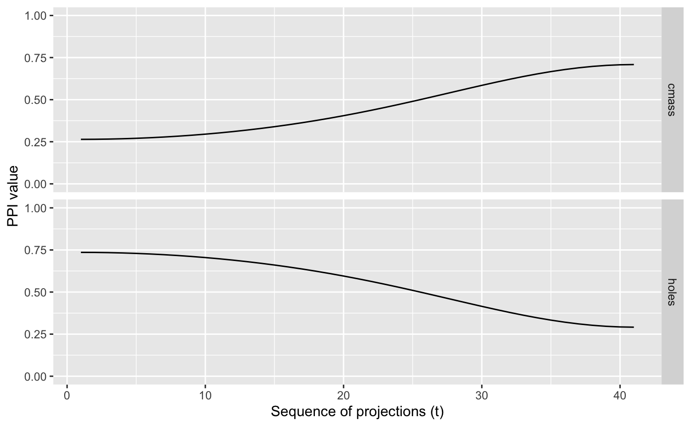

<!-- README.md is generated from README.Rmd. Please edit that file -->

# spinebil

<!-- badges: start -->

<!-- badges: end -->

Studying Projection Pursuit INdex functions through Exploration Based on
Interpolated tour paths and Line graphs. spinebil provides
functionalities to evaluate the performance of projection pursuit index
functions using tour methods as presented in [this
paper](https://arxiv.org/abs/1902.00181).

## Installation

You can install the released version of spinebil from CRAN with:

``` r
install.packages("spinebil")
```

You can install the development version from
[GitHub](https://github.com/) with:

``` r
# install.packages("devtools")
devtools::install_github("uschiLaa/spinebil")
```

## Example

To evaluate the index behaviour on a known input distribution we can
trace its value when interpolating a tour path, for example moving from
nuisance and structured projection.

``` r
library(spinebil)
## sample from the spiral distribution
d <- spiralData(4, 100)
## the first two parameters are noise
## parameters 3 and 4 contain a spiral
## we write a list with the nuisance and structured plane
m <- list(basisMatrix(1,2,4), basisMatrix(3,4,4))
## the index functions to be evaluated should also be passed in a list
indexList <- list(tourr::holes(), tourr::cmass())
indexLabels <- c("holes", "cmass")
## we can now compute the index traces and plot them
trace <- getTrace(d, m, indexList, indexLabels)
#> target_dist - cur_dist: 0 
#> generation:  dist =   1.03966 
#> target_dist - cur_dist: 1.03966 
#> generation:  dist =   1.533671 
#> target_dist - cur_dist: 0 
#> generation:  dist =   2 
#> target_dist - cur_dist: 0 
#> target_dist - cur_dist: 0 
#> generation:  dist =   2 
#> target_dist - cur_dist: 2 
#> target_dist - cur_dist: 1.95 
#> target_dist - cur_dist: 1.9 
#> target_dist - cur_dist: 1.85 
#> target_dist - cur_dist: 1.8 
#> target_dist - cur_dist: 1.75 
#> target_dist - cur_dist: 1.7 
#> target_dist - cur_dist: 1.65 
#> target_dist - cur_dist: 1.6 
#> target_dist - cur_dist: 1.55 
#> target_dist - cur_dist: 1.5 
#> target_dist - cur_dist: 1.45 
#> target_dist - cur_dist: 1.4 
#> target_dist - cur_dist: 1.35 
#> target_dist - cur_dist: 1.3 
#> target_dist - cur_dist: 1.25 
#> target_dist - cur_dist: 1.2 
#> target_dist - cur_dist: 1.15 
#> target_dist - cur_dist: 1.1 
#> target_dist - cur_dist: 1.05 
#> target_dist - cur_dist: 1 
#> target_dist - cur_dist: 0.95 
#> target_dist - cur_dist: 0.9 
#> target_dist - cur_dist: 0.85 
#> target_dist - cur_dist: 0.8 
#> target_dist - cur_dist: 0.75 
#> target_dist - cur_dist: 0.7 
#> target_dist - cur_dist: 0.65 
#> target_dist - cur_dist: 0.6 
#> target_dist - cur_dist: 0.55 
#> target_dist - cur_dist: 0.5 
#> target_dist - cur_dist: 0.45 
#> target_dist - cur_dist: 0.4 
#> target_dist - cur_dist: 0.35 
#> target_dist - cur_dist: 0.3 
#> target_dist - cur_dist: 0.25 
#> target_dist - cur_dist: 0.2 
#> target_dist - cur_dist: 0.15 
#> target_dist - cur_dist: 0.1 
#> target_dist - cur_dist: 0.05
plotTrace(trace)
```


